# Img2ContourAscii

A command-line image-to-ASCII converter that picks characters based on **shape**, not just brightness. Edges and contours are followed accurately because each character is matched against the actual visual structure of the image region it occupies.

---

## Credit

This is a Python port of an idea and algorithm created entirely by **Alex Harri**. The approach is documented in detail in his blog post:

> [ASCII characters are not pixels: a deep dive into ASCII rendering](https://alexharri.com/blog/ascii-rendering)

The original TypeScript implementation is part of his website's open source repository:

> [github.com/alexharri/website](https://github.com/alexharri/website)

Alex was not involved in this project. All credit for the core algorithm belongs to him.

---

## AI Generated

This implementation was written by **Claude (Anthropic)** based on Alex Harri's blog post and reference TypeScript source. No code was written by hand.

---

## How it works

### The problem with brightness-only rendering

Traditional ASCII renderers assign a character to each grid cell based on average brightness alone — effectively treating characters as square pixels. This produces blurry edges because the *shape* of the character is ignored.

### Shape vectors

Each ASCII character occupies a cell differently. `T` is dense at the top, `L` is dense along the left and bottom, `/` is dense diagonally. Alex Harri's approach captures this by defining **six sampling circles** arranged across each cell:

```
  (●)   (●)    ← top row    (staggered for better coverage)
  (●)   (●)    ← middle row
  (●)   (●)    ← bottom row
```

For each character in the alphabet, the fraction of ink inside each circle is measured and stored as a **6-dimensional shape vector**. These are pre-computed in `default.json` (taken directly from Alex's repository).

### Matching image cells to characters

The same six circles are sampled at each grid cell in the image to produce a 6D **sampling vector**. A KD-tree nearest-neighbour search finds the character whose shape vector is closest — the character that best *fits* the image region's structure.

### Contrast enhancement

Two contrast passes sharpen boundaries between regions:

1. **Directional crunch** — Ten additional circles sample just *outside* the current cell's boundary. If a neighbouring region is brighter, the corresponding internal component is pushed down, exaggerating the boundary shape and preventing staircase artefacts.

2. **Global crunch** — The sampling vector is normalised by its own maximum, raised to a power, then rescaled. Increases contrast between lighter and darker components without affecting uniform regions.

### Performance

Sampling is fully vectorised with numpy — no Python pixel loops. Results are cached using a quantised lookup table (Alex's own approach from the appendix of his post), so repeated or similar cell values are O(1) dict hits after warmup. This makes live video viable on a Raspberry Pi 4.

### Colour (extra)

The `--color` flag adds ANSI 24-bit colour codes to each character using the average colour of the corresponding image region.

---

## Installation

The image renderer is installable from this repo as a Python package
that drops a `img2contourascii` console command on your `PATH` and
exposes `Renderer` / `convert()` for use as a library.

```bash
# Latest from GitHub
pip install git+https://github.com/JamesM92/Img2contourascii

# Or, from a local clone
git clone https://github.com/JamesM92/Img2contourascii
pip install ./Img2contourascii
```

`numpy`, `Pillow`, and `scipy` are pulled in automatically.

For video / webcam support (separate script, not part of the
installed package — install only what you need):

```bash
pip install imageio            # GIF and basic formats
pip install imageio[ffmpeg]    # MP4, AVI, MKV, etc.
pip install picamera2          # Raspberry Pi Camera Module
```

---

## Image rendering — `img2contourascii` CLI

```
img2contourascii <image> [options]
```

(The legacy invocation `python Img2ContourAscii.py <image> [options]`
still works — it's a one-line shim that calls into the installed
package, kept for backwards compatibility with existing scripts.)

| Option | Default | Description |
|---|---|---|
| `--cols N` | terminal width | Output width in characters |
| `--global-crunch F` | `2.2` | Global contrast exponent |
| `--directional-crunch F` | `2.8` | Directional contrast exponent |
| `--color` | off | ANSI 24-bit colour output |
| `--invert` | off | Invert lightness (bright→sparse, dark→dense — useful for photos) |
| `--autocontrast` | off | Stretch luminance range to [0, 1] before rendering |
| `--char-ratio F` | `1.3333` | Cell height/width ratio — tune if output looks squished |
| `--exclude CHARS` | `""` | Characters to never use, e.g. `--exclude "\|$"` |
| `-o [FILE]` | stdout | Write to file; omit filename to auto-generate |

### Examples

```bash
# Basic render to terminal
img2contourascii photo.jpg

# Wider, colour, saved to file
img2contourascii photo.jpg --cols 120 --color -o

# Photo-friendly (dark areas become dense)
img2contourascii photo.jpg --invert --autocontrast

# Higher contrast
img2contourascii photo.jpg --global-crunch 3.0 --directional-crunch 3.5
```

### Python API

`Renderer` and the `convert()` shorthand can be imported directly for use in other scripts:

```python
from img2contourascii import Renderer, convert

# One-shot helper — opens the image, renders, returns a string
text = convert("photo.jpg", cols=80, use_color=True, autocontrast=True)

# Reusable renderer — build once, call render_frame() per image/frame
import numpy as np
from PIL import Image

renderer = Renderer(cols=120, use_color=True, autocontrast=True)
img_arr  = np.array(Image.open("photo.jpg").convert("RGB"), dtype=np.float32)
text     = renderer.render_frame(img_arr)
```

---

## Video / webcam rendering — `ContourAscii_Video.py`

```
python ContourAscii_Video.py <file>     [options]   # video file or GIF
python ContourAscii_Video.py --webcam   [options]   # USB webcam
python ContourAscii_Video.py --picam    [options]   # Raspberry Pi Camera Module
```

| Option | Default | Description |
|---|---|---|
| `--fps F` | from file / 30 | Override playback FPS |
| `--loop` | off | Loop video / GIF continuously |
| `--device N` | `0` | Webcam device index |
| `--cam-width N` | `640` | Capture width for webcam / Pi Camera |
| `--cam-height N` | `480` | Capture height for webcam / Pi Camera |
| *(all image options)* | | `--cols`, `--color`, `--invert`, `--autocontrast`, etc. |

### Examples

```bash
# Play a video file
python ContourAscii_Video.py clip.mp4 --color

# Loop an animated GIF
python ContourAscii_Video.py animation.gif --loop

# Live webcam at 80 columns
python ContourAscii_Video.py --webcam --cols 80 --color

# Raspberry Pi Camera
python ContourAscii_Video.py --picam --cols 60 --color --invert
```

The video script imports `Renderer` from `Img2ContourAscii.py` — no code is duplicated, and video dependencies are only needed if you actually use that script.

---

## Examples

All still-image renders use `--cols 60 --autocontrast`.
The globe animation uses `--cols 50 --autocontrast`.
Each table row shows the plain render (top) and colour render (bottom) for each method.

---

### Apple

<table>
<tr>
<td align="center"><b>Original</b></td>
<td align="center"><b>Brightness only</b></td>
<td align="center"><b>Contour (this tool)</b></td>
</tr>
<tr>
<td rowspan="2" align="center">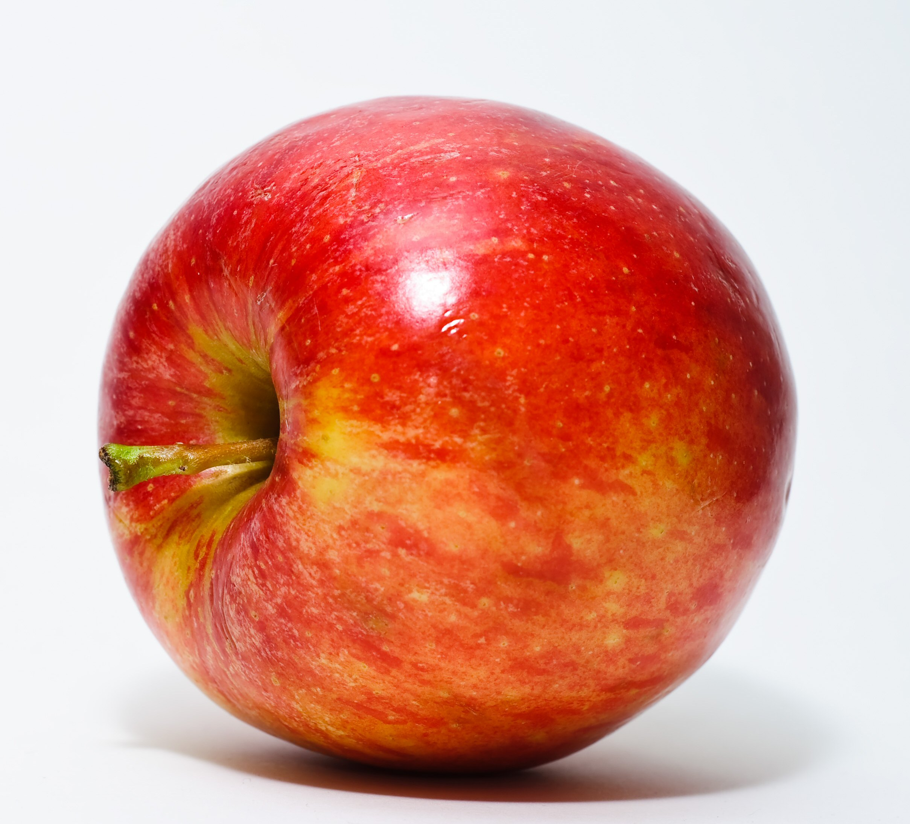<br/><i>source</i></td>
<td>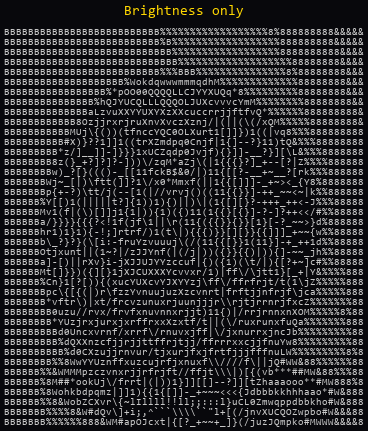</td>
<td>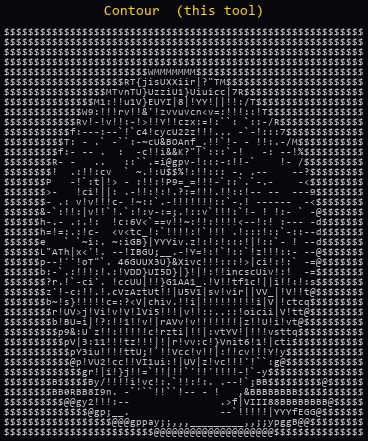</td>
</tr>
<tr>
<td>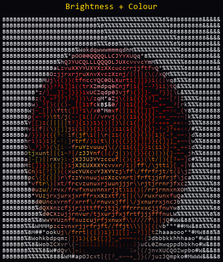</td>
<td>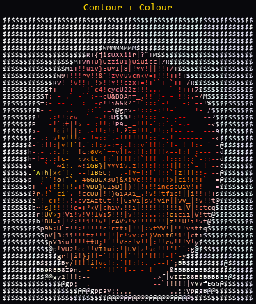</td>
</tr>
</table>

**Animated comparison** (brightness &rarr; brightness+colour &rarr; contour &rarr; contour+colour):

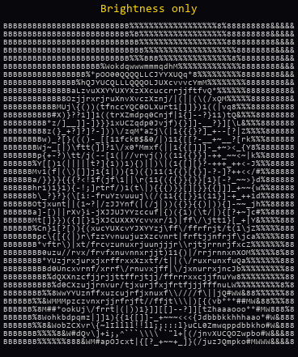

> Photo: Red apple &mdash; Abhijit Tembhekar, CC BY 2.0, via [Wikimedia Commons](https://commons.wikimedia.org/wiki/File:Red_Apple.jpg).

---

### Cat

<table>
<tr>
<td align="center"><b>Original</b></td>
<td align="center"><b>Brightness only</b></td>
<td align="center"><b>Contour (this tool)</b></td>
</tr>
<tr>
<td rowspan="2" align="center">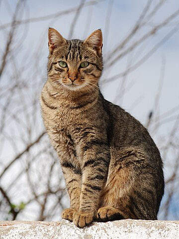<br/><i>source</i></td>
<td></td>
<td>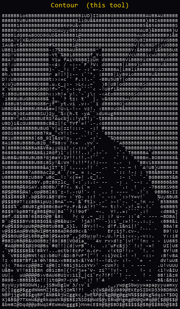</td>
</tr>
<tr>
<td>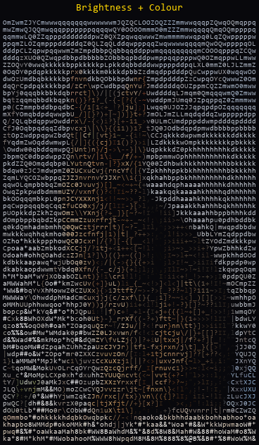</td>
<td>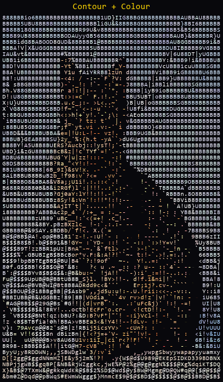</td>
</tr>
</table>

**Animated comparison** (brightness &rarr; brightness+colour &rarr; contour &rarr; contour+colour):

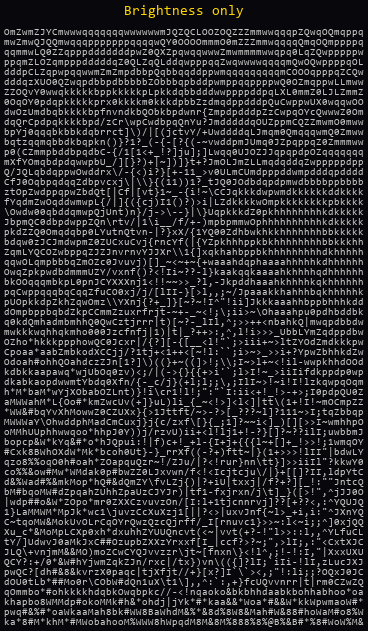

> Photo: Cat portrait. Public domain, via [Wikimedia Commons](https://commons.wikimedia.org/wiki/Category:Photographs_of_cats).

---

### Globe (animated source)

The source is a 24-frame spinning-globe GIF (512&times;512). Each frame is rendered independently
and the output GIFs loop at the original frame rate.

<table>
<tr>
<td align="center"><b>Source GIF</b></td>
<td align="center"><b>Brightness only</b></td>
<td align="center"><b>Contour (this tool)</b></td>
</tr>
<tr>
<td rowspan="2" align="center">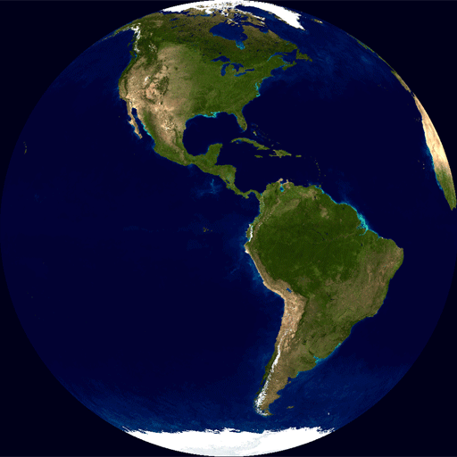<br/><i>source</i></td>
<td>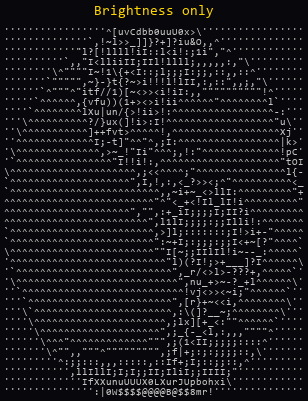</td>
<td>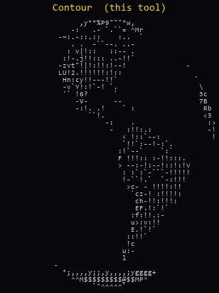</td>
</tr>
<tr>
<td>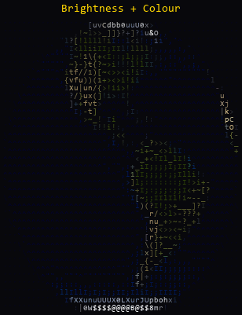</td>
<td>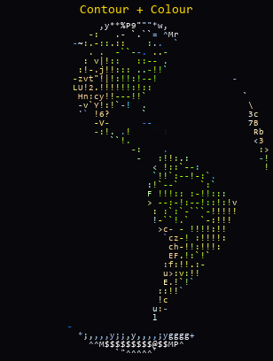</td>
</tr>
</table>

> Animation: Spinning globe &mdash; Wikiscient, CC BY-SA 3.0, based on NASA Visible Earth imagery (public domain), via
> [Wikimedia Commons](https://commons.wikimedia.org/wiki/File:Globespin.gif).
